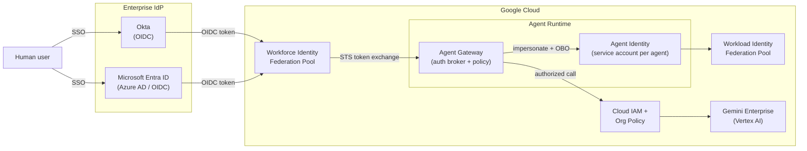

# demo-agent-gateway-agent-id

**Agent Gateway + Agent Identity on Google Cloud — federated with Okta and Microsoft Entra ID (Azure AD), calling Gemini Enterprise.**

This demo shows how an AI agent running on Google Cloud obtains a **verifiable, short-lived identity** that is federated from your existing enterprise IdP (Okta or Entra ID), and uses that identity to call **Gemini Enterprise** through an **Agent Gateway** that enforces per-agent authorization.

It answers three questions security architects ask about agentic AI:

1. **Who is the agent?** — Every agent gets its own identity, not a shared key. (Agent Identity / dedicated service accounts + Workload Identity Federation.)
2. **How does a human's identity reach the agent?** — Workforce Identity Federation brings Okta / Entra ID users into GCP without minting GCP passwords, so the agent can act **on-behalf-of** an authenticated human.
3. **What can the agent do, and to what?** — The Agent Gateway brokers every Gemini Enterprise call, attaches the agent's identity, and enforces IAM + policy before the model is ever reached.

> ⚠️ **Demo / reference code.** Values are placeholders. Nothing here provisions live billing-bearing resources until you supply real IDs in `terraform.tfvars`. Review before running in any real project.

---

## Architecture



**Flow, step by step**

| # | Step | Identity primitive |
|---|------|--------------------|
| 1 | Human signs in to Okta or Entra ID via SSO | Enterprise IdP (OIDC) |
| 2 | IdP OIDC token is exchanged at Google STS for a federated token | **Workforce Identity Federation** |
| 3 | Agent Gateway validates the caller and selects the agent identity | Agent Gateway policy |
| 4 | Gateway obtains a short-lived token for the agent's service account | **Agent Identity** (SA impersonation / WIF) |
| 5 | Gateway calls Gemini Enterprise with the agent's credentials + OBO subject | Cloud IAM |
| 6 | IAM + Org Policy authorize (or deny) the specific model + method | Policy enforcement |

---

## Repository layout

```
demo-agent-gateway-agent-id/
├── README.md                     ← you are here
├── docs/
│   └── architecture.md           ← deep dive: token exchange, OBO, trust chains
├── terraform/                    ← IaC for the two federation pools + agent SA + Gemini
│   ├── main.tf
│   ├── variables.tf
│   ├── workforce_okta.tf         ← Workforce pool + Okta OIDC provider
│   ├── workforce_azuread.tf      ← Workforce pool provider for Entra ID
│   ├── agent_identity.tf         ← per-agent service account + WIF pool
│   ├── gemini_enterprise.tf      ← Gemini Enterprise / Vertex AI enablement + IAM
│   ├── outputs.tf
│   └── terraform.tfvars.example
├── app/                          ← Python Agent Gateway reference implementation
│   ├── config.py
│   ├── agent_gateway.py          ← the broker: validate → impersonate → call Gemini
│   ├── auth/
│   │   ├── okta_provider.py
│   │   ├── azuread_provider.py
│   │   └── federation.py         ← STS token exchange + SA impersonation
│   └── gemini/
│       └── client.py             ← Gemini Enterprise call wrapper
├── scripts/
│   ├── setup_okta_provider.sh    ← gcloud commands, idempotent
│   ├── setup_azuread_provider.sh
│   └── demo_run.sh               ← end-to-end local walkthrough
└── .github/workflows/ci.yml      ← lint + terraform validate
```

## Quick start

```bash
# 1. Configure your project + IdP details
cp terraform/terraform.tfvars.example terraform/terraform.tfvars
$EDITOR terraform/terraform.tfvars

# 2. Provision federation pools, agent identity, and Gemini enablement
cd terraform && terraform init && terraform apply

# 3. Run the Agent Gateway locally against Gemini Enterprise
cd ../app && pip install -r requirements.txt
python agent_gateway.py --idp okta --prompt "Summarize our Q3 security posture"
```

See [`docs/architecture.md`](docs/architecture.md) for the full trust-chain walkthrough.

## What to demo live

- **Least privilege per agent** — delete the agent SA's `aiplatform.user` binding and watch the same request get denied at the gateway, proving the model is never reached without identity.
- **IdP swap** — flip `--idp okta` to `--idp azuread`; the same agent works, only the front-door federation changes.
- **On-behalf-of** — show the Gemini audit log carrying both the agent SA *and* the original human subject from the Okta/Entra token.

## License

Apache-2.0 — see [`LICENSE`](LICENSE).
