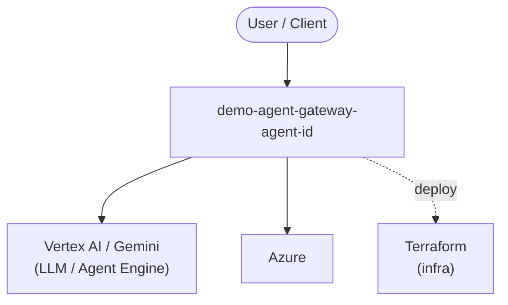

# Context Map — `demo-agent-gateway-agent-id`

> Auto-generated architecture & deployment context map. Summarizes the core application, container/cloud footprint, and database connections. Regenerate after significant structural changes.

**Repo:** `avnit/demo-agent-gateway-agent-id` · **Original** · Public · Primary language: Jupyter Notebook · Default branch: `main` · Files: 28

## 1. Core application

demo-agent-gateway-agent-id

- **Frameworks / runtime:** Jupyter notebooks

## 2. Containers & cloud applications

**Infrastructure as Code:**
- `terraform/agent_identity.tf`
- `terraform/gemini_enterprise.tf`
- `terraform/main.tf`
- `terraform/outputs.tf`
- `terraform/variables.tf`
- `terraform/workforce_azuread.tf`
- `terraform/workforce_okta.tf`

**Detected cloud platforms / services:** Vertex AI / Gemini (GCP), Azure, Terraform

## 3. Database connections

_No database drivers or connection strings detected._

## 4. Architecture diagram

## 5. Security posture

- No open Dependabot alerts or static-scan findings recorded.

---
_Generated by repo context-mapping pass on 2026-08-13._